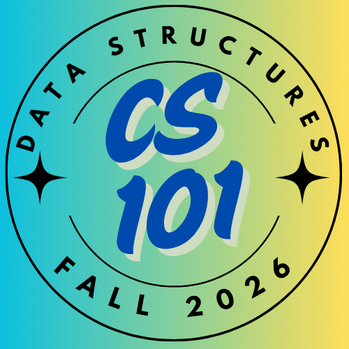

**CMPSC101 :: Data Structures :: Fall 2026**

{width=20%}

Here you will find a listing of lesson materials for the course such as slides, assignments, and similar.

- **Project Downloads**: [Starter files, tutorials, and other downloadable project materials](1_project_files.html)

<!-- {width=10%} -->

## W1. Welcome Weeks

- [Syllabus](https://dodatastructures.com)
- **Getting to Know You**: [Welcome Week Survey](https://docs.google.com/forms/d/e/1FAIpQLSfbOmz3HgLI9b_cWzUxRhKHTEVV9X-BYZYSUOSSwnzD2OiQOQ/viewform?usp=sharing&ouid=103252844525990438220)
- **Getting to know your neighbor** Pair-up with another person in the class to ask the following interview questions. Write down their answers -- you will be introducing them during next class using several of the below personal facts.

- Get to know your peer by asking the following types of questions
  -  *What is your name, and what would you like us to know about you?*
  -  *Where is home?*
  -  *What is your favorite part about life at Allegheny College so far?*
  -  *Do you have any Computer Science experience(s) already (jobs, academic, industrial, similar)?*
  -  *Can you share any experiences with programming projects?*
  -  *What is your favorite way to spend a weekend?*
  -  *What is one thing you hope to learn or be able to do by the end of this course?*
  -  *What is your favorite breakfast cereal?*
  
- Installing necessary software for the course (if anyone needs help!) 
  - [Python](https://www.python.org/)
  - [Visual Studio Code](https://code.visualstudio.com/download) 
  - [GitHub](https://github.com/git-guides/install-git)
  - [Pipx](https://pipx.pypa.io/stable/installation/)
  - [Discord](https://discord.com/download)

- Shared values activity
  - The Department's [Shared Values](https://www.cis.allegheny.edu/teaching/policies/)

<!-- ## W2. Reviewing Python -->
<!-- - Be sure to join the class' GitHub Organization (check your email!) -->
<!-- - Be sure that you are in the Discord channel for the course. If you are not in the Discord channel, please let me know! Also, please use your real names in the channel (otherwise  I will not be able to identify you). -->

<!-- - **Literals, Variables, Conditionals, Strings, etc. **  -->
  <!-- - [HTML](2_i_introToPython_solutions.html) Slides -->
<!-- - **Loops, Dictionaries and Lists ** 
  - [HTML](3_ii_introToPython_solutions.html) Slides -->
<!-- - **Lab 01**: Mastering Python Loops
  - [GitHub Classroom Link](https://classroom.github.com/a/AnsmidnZ) -->

---

<!-- ## Special Notes
::: {.callout-note}
## Please plan accordingly for the following important deadlines:
- The final project will be due on April 30th, 2026 at 9:00am.
- Presentations will be held on Friday, 24th April 2026 during lab.
- These are hard deadlines and no late submissions can be accepted.
::: -->
